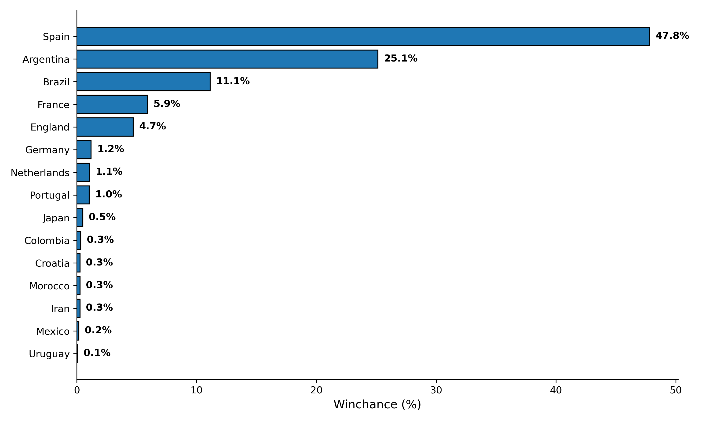

# 🏆 World Cup 2026 Monte Carlo Simulator


A complete Data Science pipeline and simulation engine that predicts the winner of the expanded **48-team FIFA World Cup 2026**. 

Instead of relying on simple guesswork, this project pulls historical match data, builds a custom **Elo rating system**, calculates team-specific **Attack/Defense Strengths**, and runs **10,000 Monte Carlo simulations** to find the mathematical probabilities of each nation lifting the trophy.


*(Example output of 10,000 simulations. Probabilities adjust dynamically based on the latest data).*

---

## 🚀 Key Features

* **ETL Pipeline (`datafetcher.py`):** Automatically fetches, cleans, and time-filters historical international match data (from August 2018 onwards to ensure modern form relevance).
* **Custom Elo Engine (`elo_engine.py`):** Calculates dynamic Elo ratings for all national teams based on actual historical results.
* **Statistical Modeling (`team_stats_engine.py`):** Calculates expected Attack Strength (AS) and Defense Strength (DS) metrics relative to global averages.
* **Poisson Match Simulator (`match_simulator.py`):** Uses statistical distribution to simulate realistic match scores (xG).
* **Complex 48-Team Bracket Logic (`tournament_logic.py`):** Implements FIFA's 2026 format, including the "8 best third-place teams" logic.
* **Monte Carlo Engine (`main.py`):** Simulates the entire tournament 10,000 times.

---

## 🛠️ Installation & Usage

1. **Clone the repository:**
   ```bash
   git clone https://github.com/LaxenOsund/world-cup-simulation.git
   cd world-cup-simulation
   ```
2. **Install dependencies:**
   ```bash
   pip install pandas matplotlib
   ```
3. **Run the Simulation:**
   ```bash
   python main.py
   ```
   
### 📂 Project Structure

```text
world-cup-simulation/
├── main.py                  # Main orchestrator (Monte Carlo loop)
├── match_simulator.py       # Core match logic (Poisson distribution)
├── tournament_logic.py      # FIFA rules and bracket routing
├── datafetcher.py           # Data cleaning & ETL pipeline
├── engines/                 # Mathematical Core
│   ├── elo_engine.py        # Calculates Team Elo ratings
│   └── team_stats_engine.py # Calculates Attack/Defense form (AS/DS)
└── results.csv              # Filtered dataset (International results)
```

## 🧠 The Math Behind the Magic
The engine calculates an expected goal (xG) value for each team based on Elo differences and Attack/Defense ratings. These variables are fed into a Poisson Distribution algorithm, generating realistic football scores.

---
*Created as a data science portfolio project.*
